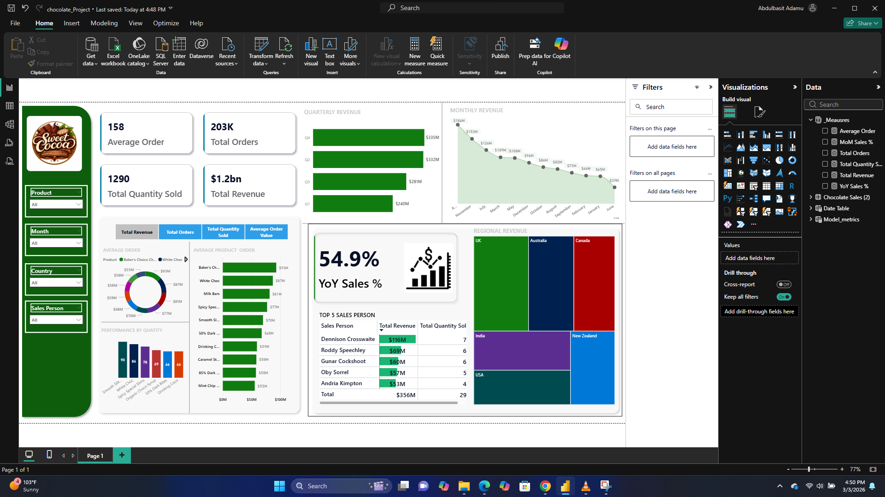

# Chocolate Sales Analytics Dashboard  

This project showcases an interactive Power BI dashboard designed to analyze chocolate sales data and generate actionable business insights.

---

## Project Overview  

The **Chocolate Sales Analytics Dashboard** consolidates key sales metrics into a single, dynamic and visually engaging report. It enables stakeholders to evaluate overall revenue performance, monitor sales trends over time, identify top-performing products, and analyze regional or category-based performance.

This project demonstrates end-to-end Power BI development, from data cleaning and transformation in Power Query to data modeling and advanced DAX calculations for meaningful business insights.

---

## Tools & Technologies  

- Power BI  
- Power Query  
- DAX  
- Data Modeling  

---

## Key Features  

- Interactive dashboard with slicers and drill-down capabilities  
- Revenue and sales trend analysis over time  
- KPI-focused layout for quick performance assessment  
- Top and bottom product performance analysis  
- Clean, user-friendly interface designed for business stakeholders  

---

## Repository Contents  

- **chocolate_Project.pbix** – Power BI report file  
- **Dashboard Screenshots** – Visual preview of the report  
- **README.md** – Project documentation  

---

## How to View the Dashboard  

- 
- 
- See full dashboard here -  [App Power Bi link](https://app.powerbi.com/links/uL2N1y6lEV?ctid=da850715-bf86-4983-ae11-1756ac3d9894&pbi_source=linkShare)

---

## Notes  

This project is intended for portfolio demonstration purposes. The dataset used is non-sensitive and structured to highlight data transformation, modeling, and visualization capabilities within Power BI.

---

## Author  

**Abu Ammar**  
Data Analyst | Business Intelligence  
